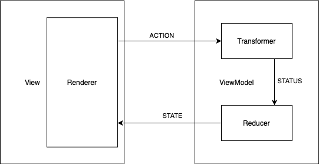

## CV

- [Overview](#overview)
- [Architecture](#architecture)
- [Main 3rd party libraries](#main-3rd-party-libraries)
- [Testing](#testing)

## Overview
Application that downloads and renders CV of mine.

### Features
- Displaying list of CV items (photo, summary, personal development, job positions and hobbies).
- Navigating to social media links (Medium, StackOverflow, YouTube)

## Architecture

### Flow diagram

### View
`View`(Activity) is responsible for gluing `ViewModel` class with rendering function. Besides, it is responsible for sending intention actions that can be anything like user interaction or system callbacks. The `View` should not contain any rendering, business logic.

### ViewModel
`ViewModel` has a definition of supported intentions. Every action that `View` sends to the `ViewModel` has to be declared as intention.
Intention reacts to the action with action transformation that produces unique status. In this case transformation is a backend call that downloads CV data. Transformed data are not ready to be displayed so intention uses reduction function to generate new immutable state. A new
state is pushed to the `View` layer and renders there. All intention actions are transformed asynchronously and that is baked into [ConnectableViewModel](../../blob/master/mvi/src/main/kotlin/com/slesarew/mvi/ConnectableViewModel.kt).

#### Transformer
A function that transforms Action to Status data. Can be a backend call that returns data or fire and forget command like database save/update operation.

#### Reducer
A pure function that reduces the current state of the screen using transformation status data.

### Renderer
A [Renderer](../../blob/master/app/src/main/kotlin/com/slesarew/cv/cvscreen/view/renderer/CVRenderer.kt) is a simple class that uses `RecyclerView` as the main render engine. It has two main responsibilities:
- Setup `RecyclerView` with correct adapter class.
- Transform immutable view state to adapter items and render them on the screen.

Render function has to be pure! It cannot use any properties outside of its scope. To simplify working with
`RecyclerView` I use [Groupie](https://github.com/lisawray/groupie) library. It also makes rendering logic more declarative.

### Dependency Inversion
Dependency Inversion is implemented with the [Koin](https://github.com/InsertKoinIO/koin) dependency injection framework. It simplifies the separation of objects' creations and their usages. In addition, Koin has a pretty
easy integration with Architecture Component's `ViewModel` class so it simplifies gluing it with view layer.

### Packaging
The code is structured using "package by feature" approach. The main reason for such packaging
is to imitate app domain structure into the code.

### Modularisation
Project has two modules:
- `:mvi` module that contains helper classes for unidirectional flow architecture (Android library module).
- `:app` module that contains the application logic and screens (Android application module).

## Main 3rd party libraries

##### Rendering
- [Groupie](https://github.com/lisawray/groupie)
- [Glide](https://github.com/bumptech/glide)

##### Networking
- [Retrofit](https://github.com/square/retrofit)
- [Gson](https://github.com/google/gson)

##### Dependency injection
- [Koin](https://github.com/InsertKoinIO/koin)

##### Asynchronous programming
- [Kotlin Coroutines](https://github.com/Kotlin/kotlinx.coroutines)

##### Testing
- [jUnit5](https://junit.org/junit5/docs/current/user-guide/)
- [jUnit4](https://junit.org/junit4/)
- [Robolectric](https://github.com/robolectric/robolectric)

## Testing strategy
Codebase is tested using two different strategies:
- Business logic and Repository is tested using jUnit 5 tests.
- Rendering logic is tested using Robolectric jUnit 4 tests.
