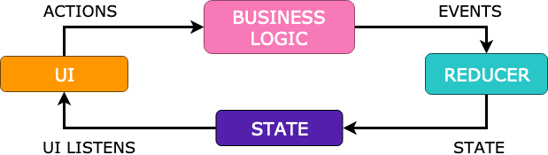

## CV

- [Overview](#overview)
- [Architecture](#architecture)
- [3rd party libraries](#main-3rd-party-libraries)
- [Known issues](#testing)

## Overview
Application that downloads and renders CV of mine.

### Features
+ Displaying list of CV items (photo, summary, personal development, job positions and hobbies). 

## Architecture

### Packaging
The code is structured using "package by feature" approach. The main reason for such packaging
is to imitate app domain structure into the code.

### Dependency Inversion
Dependency Inversion is implemented with Koin dependency injection framework. It simplifies separation of objects creations and their usages. In addition Koin has a pretty
easy integration with Architecture Component's `ViewModel` class so it simplifies gluing it with view layer.

### View
View(Activity) is responsible for gluing `ViewModel` class with rendering function. In addition it is responsible for sending intention actions that can be anything like
user interaction or system callbacks. View should not contain any rendering, business logic.

### ViewModel
`ViewModel` has definition of supported intentions. Every action that `View` sends to the `ViewModel` has to be declared as intention.
Intention reacts to the action with action transformation that produces unique status. In our case transformation is a backend call that 
downloads CV data. Transformed data are not ready to be displayed so intention uses reduction function to generate new immutable state. New
state is pushed to `View` layer and renders there. All intention actions are transformed asynchronously and that is baked into ConnectableViewModel.kt.

#### Transformer
Function that transform Action to Status data. Can be a backend call that returns data or fire and forget command like database save/update operation.

#### Reducer
Pure function that reduces current state of the screen using transformation status data.

### Renderer
Renderer is a simple class that uses `RecyclerView` as main render engine. It has two main responsibilities:
1. Setup `RecyclerView` with correct Adapter class.
2. Transform immutable view state to Adapter items and render them on the screen.

Render function has to be pure! It cannot use any properties for the outside of it's scope. To simplify working with
`RecyclerView` I use Groupie library. It also makes rendering logic more declarative.

## Main 3rd party libraries

#### Rendering
- Groupie

#### Networking
- Retrofit

#### Dependency injection
- Koin

#### Asynchronous programming
- Kotlin Coroutines

## Testing
Codebase is testes using two different strategies:
1. Business logic and Repository is tested using jUnit 5 tests.
2. Rendering logic is tested using Robolectric jUnit 4 tests.